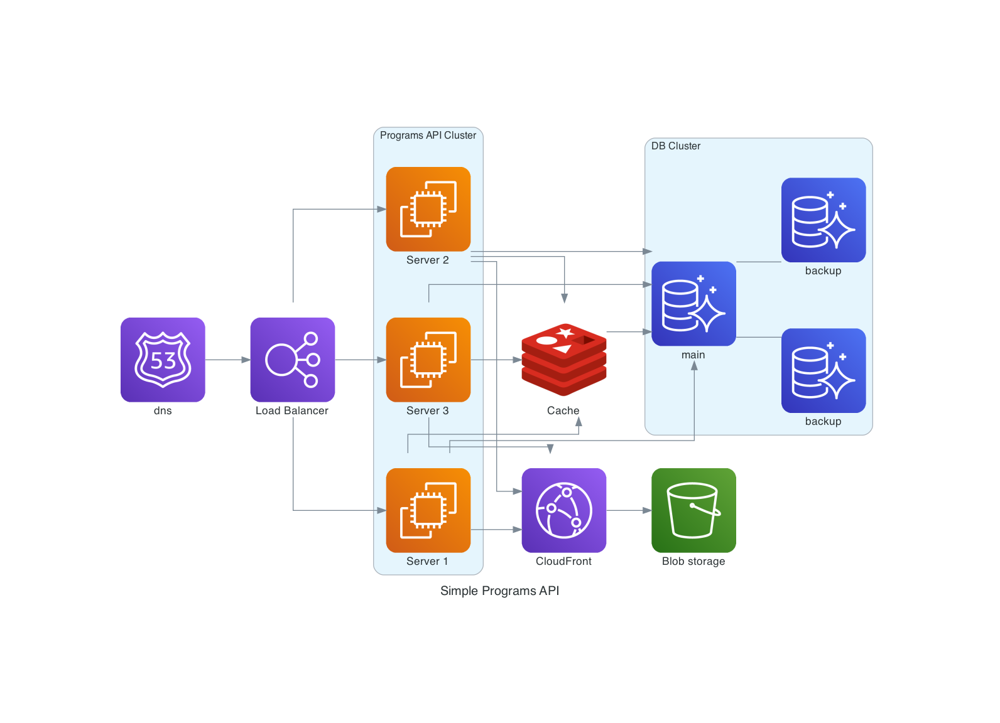

# be-modern

## Instructions

1. Create and start virtual environment

   - ```bash
     python3 -m venv be-modern
     source be-modern/bin/activate
     ```

2. Install dependencies

   - ```bash
     pip install -r requirements.txt
     ```

3. Start development server

   - ```bash
     make dev-start
     ```

## Queries and Mutations

```markdown
# Get programs

            query {
                programs {
                    id
                    name
                    description
                    sections {
                      id
                    }
                }
            }

# Get activities

            query {
                activities {
                    id
                    name
                    content
                    choices
                }
            }

# Get sections

            query {
                sections {
                    id
                    name
                    description
                    order_index
                    overview_image
                    activities {
                      id
                    }
                }
            }

# Get single section

            query {
                section(id: $id) {
                    id
                    name
                    description
                    order_index
                    overview_image
                    activities {
                      id
                    }
                }
            }

# Get single activity

            query {
                activity(id: $id) {
                    id
                    name
                    content
                    choices
                }
                }
            }

# Create program

            query {
                program(id: $id) {
                    id
                    name
                    description
                    sections {
                      id
                    }
                }
            }

# Create section

            query {
                section(id: $id) {
                    id
                    name
                }
            }

```

## Simple Architecture Diagram



## Questions

- Can activities be repeated in multiple sections ?
- Can sections be repeated in multiple program ?
- Is there any image extension we are limited to?
- Is the companies PostgreSQL database hosted on AWS ? Aurora ?
- What is the minimum or maximum number of choices within an activity ?
- How big is the html content in the activity ?
- What are the limits of height and width for an overview image in a section ?
- What is an ordering index in a section ? (Is that ordering number in which the program has you follow)

## Resources

- ['Build small docker images'](https://towardsdatascience.com/how-to-build-slim-docker-images-fast-ecc246d7f4a7)
- ['Django and Uvicorn'](https://docs.djangoproject.com/en/3.1/howto/deployment/asgi/uvicorn/)
- ['Uvicorn documentation'](https://www.uvicorn.org/)
- ['Quick django docker documentation'](https://docs.docker.com/compose/django/)
- ['Unitest with django'](https://docs.graphene-python.org/projects/django/en/latest/testing/)
- ['Graphql and Django'](https://stackabuse.com/building-a-graphql-api-with-django/)
- ['Graphene and Django'](https://www.fullstacklabs.co/blog/django-graphene-rest-graphql)
- ['JWT, Django, and Graphql'](https://django-graphql-jwt.domake.io/en/latest/index.html)
- ['Cloud Diagrams'](https://diagrams.mingrammer.com/docs/getting-started/examples)

## TODOs

- Create terragrunt folder for creating aws infrastructure such as database, servers, s3 buckets, etc
- Remove name from activity model
- Research better way of storing activity choices
- Better filtering when requesting programs, sections or activities
- Add authentication layer (might not need it since seems these would be api would be access internally)
- Research Graphene Relay
